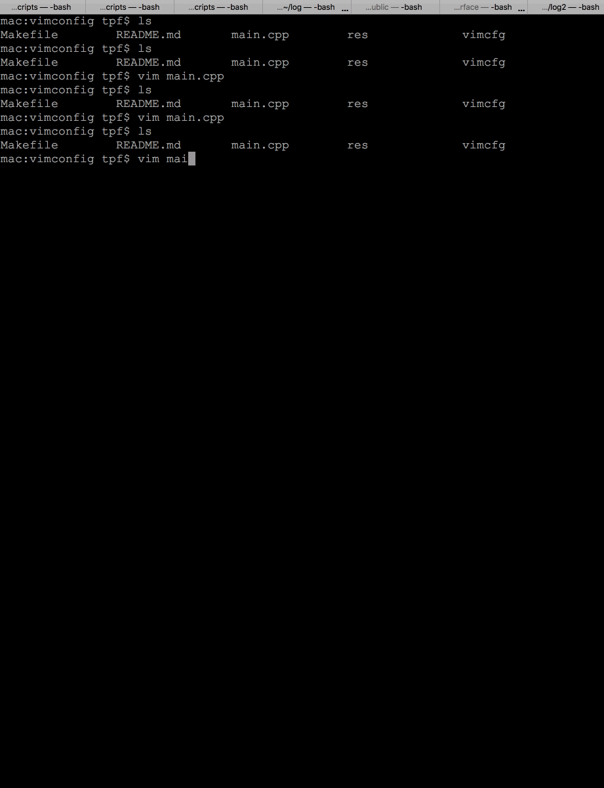
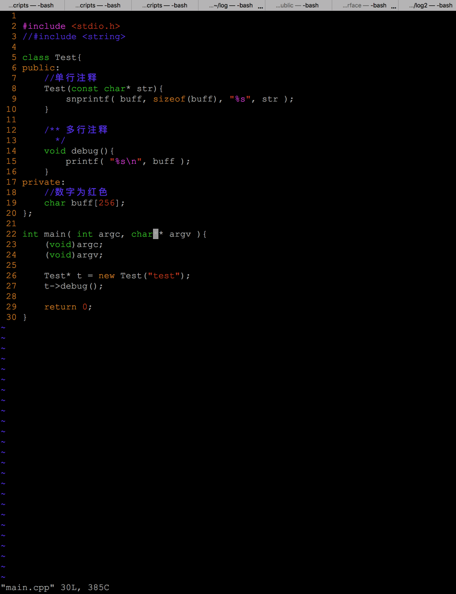
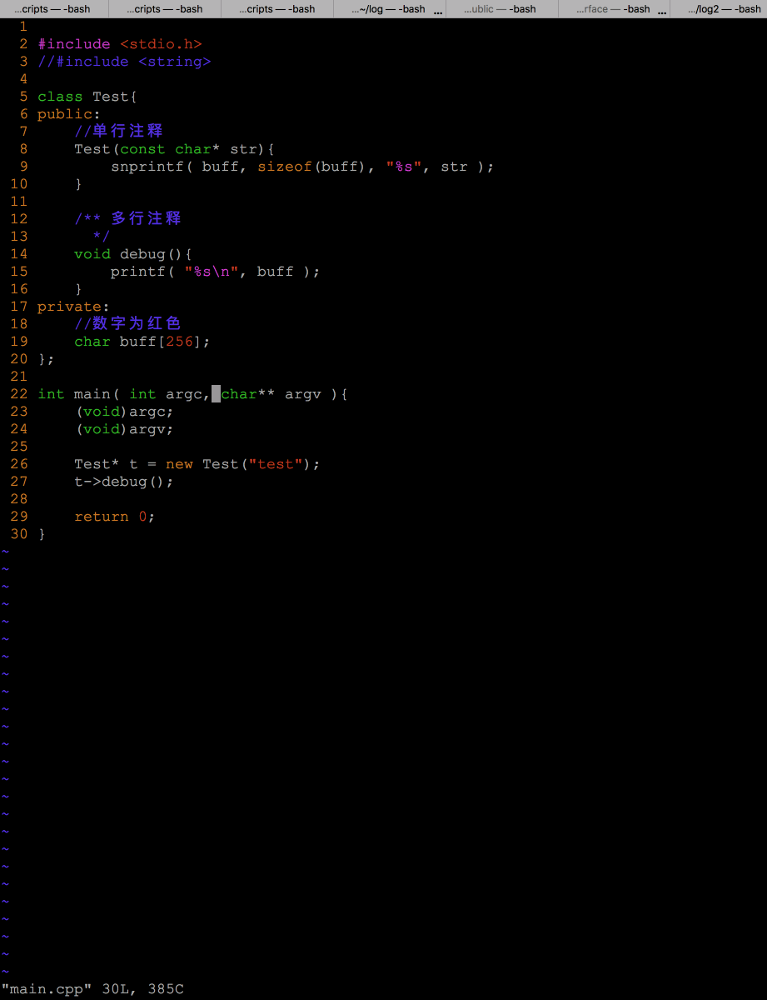
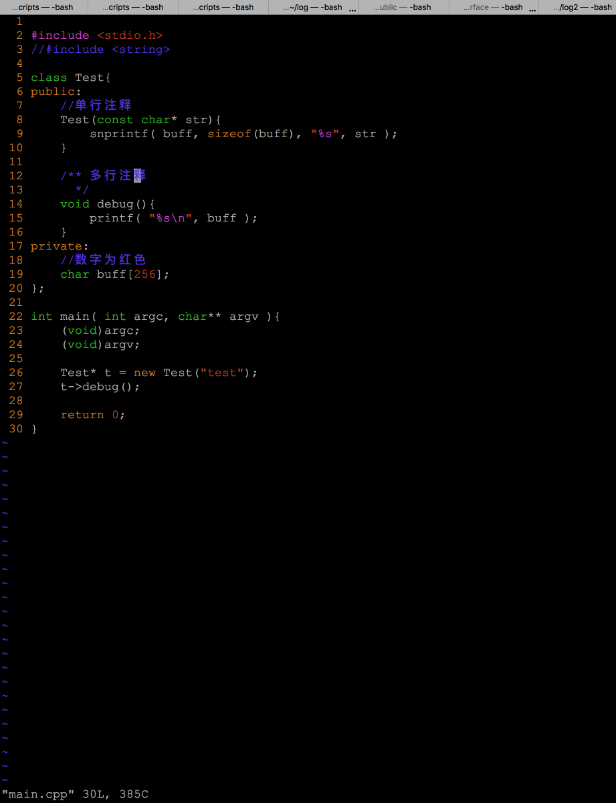
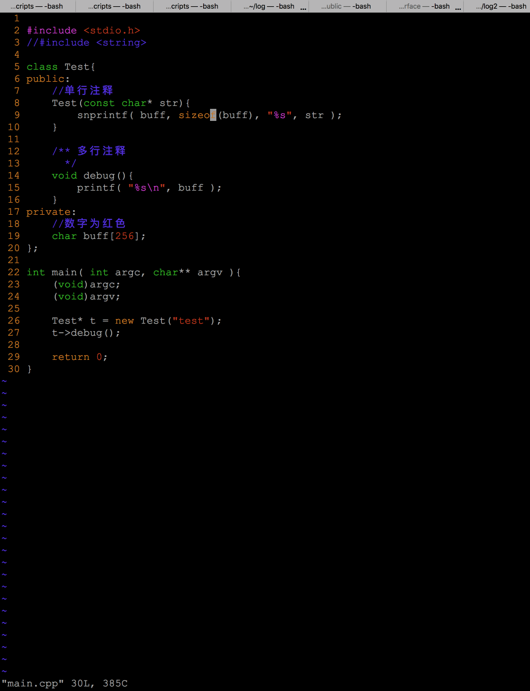
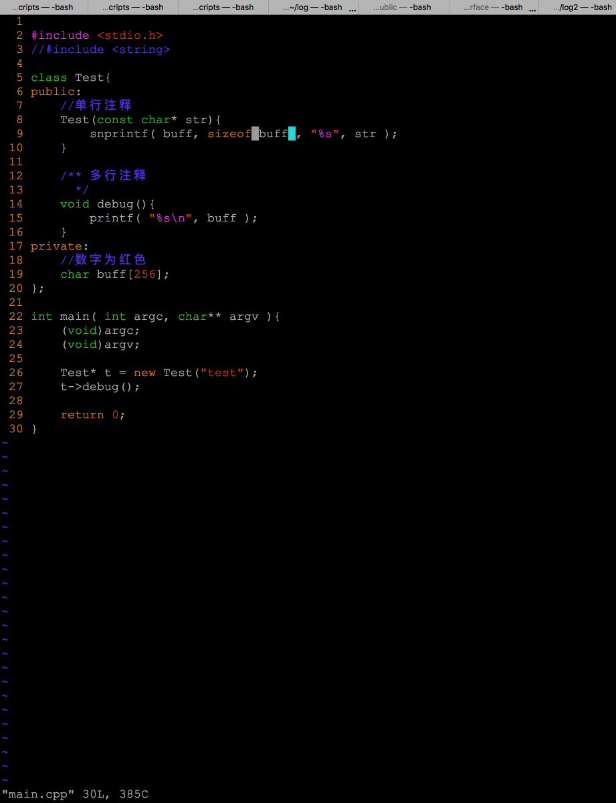

#简明的vim常用指令介绍和我用了多年的vim配置文件

	最近有同事想用vim,借着这样的机会,我就向没有用过vim,想用vim的同学简明介
	绍一下,为了让各位有比较直观的感受,我特意吐血配了一些激情小动图,希望大家
	喜欢.

	所以此文的面向对象是没用过vim,想了解vim的同学.

	一开始用vim的时候下载了很多插件,因为当时已经习惯vs了,用vim时候想尽量贴
	近vs习惯,后来随着时间退移, 发现用到的功能越来越少,比如开始用到的Tlist,cope
	在后来的代码编辑中不知道为啥渐渐不怎么用了,不过浏览开源工程时候还是挺好
	用的,打开Tlist可以看到文件的函数定义. 
	到最后整理出vimconfig的时候就只有一点点功能了，对我来说最实用的还是代
	码颜色这块,当时主要是为了配出喜欢的c,cpp代码的颜色,有兴趣的可以看
	vimcfg/.vim/syntax/tpf.vim 和vimcfg/.vim/color/c.vim文件一个是
	语法匹配,一个是颜色定义,这个是2010年的时候配的,长期不看,其实我也不
	怎么记得了.
	
	最终的配色就是这样:


## 安装vim
* ubuntu可以用下面这行命令安装
```c
bash$ sudo apt-get install vim 
```
* centos可以用下面这行命令安装
```c
bash$ sudo yum install vim 
```

## 安装vim confg
    安装配置文件只需要把vimcfg下的.vim .vimrc复制到~/目录下就可以了. 
    可以使用命令复制到目录~/下
```c
bash$ cp -rf vimcfg/.* ~/
```

## 使用vim
* 打开空的vim编辑器,在bash下输入 vim 即可
```c
bash$ vim 
```


* 退出vim
```c
在vim里输入 :q 然后回车
```

* 用vim编辑main.cpp,注意下面图中退出时候我用的是:q! 加!号表示强制退出,这个是习惯问题,就好比我在vs中写代码,当写完一段的时候下意识的按ctrl+shift+s,有时候会按住ctrl+shift+狂点s,我想这个时候我应该是已经进入高潮了,在vim里打完一段时候下意识的点:w,esc是一样的,:w就是保存的意思,esc表示退出编辑状态,而且按esc时候也有狂点esc的毛病,这个会在后面介绍编辑模式时候说到.
```c
bash$ vim main.cpp
```


* 还可以用vim打开一个目录,比如下面我打开当前目录,便会列出该目录下的所有文件. 使用j,k可以上下移动光标,选中想进入的文件后,按回车便可进入该文件,一般在工程
不熟的时候可以用这个命令在多个文件中切换,如果是自己写的项目,大多数文件名都
在心里记着, 直接vim 文件名前几个字符+tab补全就可以快速编辑该文件.
```c
bash$ vim .
```


* 移动光标,是vim里最常用的指令,使用vim的过程,在我看来基本上就是在移动光标,可以用hjkl也可以用方向键,但是强烈建议一开始就用hjkl来控制方向,这样可以极大的提高代码编辑速度,因为手可以不用在字母与方向键之间来回切换.一打开文件的时候,是正常模式,这个时候可以用hjkl在代码间来回移动,下面列出常用的移动光标指令

  一共有12种:

  * h 对应 左, 相当于 方向键的左


  * l 对应 右, 相当于 方向键的右


  * j 对应 下, 相当于 方向键的下
  * k 对应 上, 相当于 方向键的上


  * 0 (数字0)跳到一行的开头
  * $ 跳到一行的结尾


  * e 跳到一个单词的结尾


  * b 跳到一个单词的开头


  * gg 跳到文件开头
  * G 跳到文件结尾


  * ctrl + f 向下翻一页
  * ctrl + b 向上翻一页


* 下面说插入模式,就是打代码时候用的,
这里我引用一下这位同学[宙斯黄](https://www.cnblogs.com/zeushuang/archive/2012/11/16/2772830.html)的教程,因为我组织了半天也不知道该怎么明白的把下面的指令说清楚,惭愧惭愧

  这是我常用的4个插入指令:
  * i 在光标所在字符前开始输入文字并进入插入模式


  * a 在光标所在字符后开始输入文字并进入插入模式


  * o (小写字母o) 在光标所在行的下面单独开一新行来输入文字并进入插入模式


  * O (大写字母O) 在光标所在行的上面单独开一新行来输入文字并进入插入模式。


  下面是经过岁月洗礼,渐渐被我遗忘的指令,如果不是写这篇文章,我可能再也想不起来插入还有下面这些指令,有兴趣的可以了解一下,因为我不怎么用,就不介绍了
  * s 删除光标所在的字符并进入插入模式
  * I 在行首开始输入文字并进入插入模式。此行首指第一个非空白字符处。如果行首有空格，则在空格之后输入文字并进入插入模式
  * A 在行尾开始输入文字并进入插入模式。这个好用，您不必管光标在此行的什麽地方，只要按 A 就会在行尾等着您输入文字。
  * S   删除光标所在行并进入插入模式
  
* 退出插入模式,就是再回到正常模式,嗯,你猜对了就是esc,一个神奇的能让你高潮的按键,下面图中可以看到我点了o进入插入模式,写了asb然后esc退出插入模式,上下移动了光标,再点a进入了插入模式,写了asb,然后又点了esc退出插入模式,然后又上下移动了几下,强烈建议大家在看小动图的时候也新身实践一下,体验用vim写代码的快感
  * esc


* 和删除相关的指令,注意使用删除指令前需要先esc退出插入模式,为方便演示,下面的指令中用到了u,即回退,比如删掉一行后想撤销删除,可以点u
  * dd 删掉一行


  * dw 从光标删掉单词结尾,下图中注意我在一个单词的开头和中间分别用了dw,可以看出效果的不同

 
  * D 从光标删掉到行尾


* 和复制相关的指令,下面的演示中用到了粘贴指令p

  * yy 复制整行


  * yw 从光标开始复制到单词的结尾


  * y$ 从光标开始复制到行尾


* 粘帖
  * p 嗯就是把刚刚复制的文本,粘贴到光标处

* 视图模式,这个功能中可以选中一段代码.嗯,Words is cheap, show me the gif!
  * v 在正常模式中,按v可以进入视图模式,进入v后可主要是结合上面的光标和删除命令达到删除多行的效果

